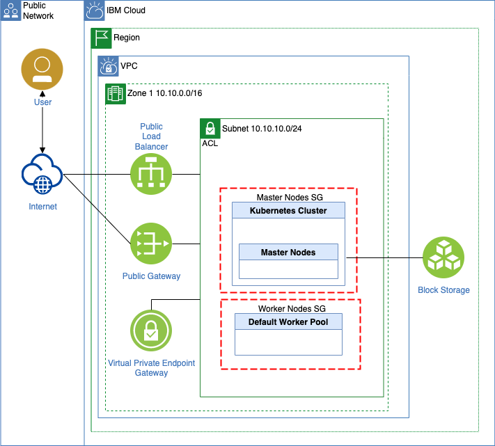
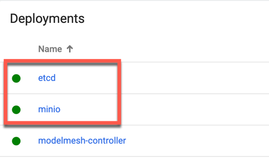

# Run Watson NLP for Embed on an IBM Cloud Kubernetes cluster

This example project has three objectives.

* Create an IBM Cloud Kubernetes cluster in a [`Virtual Private Cloud` (VPC) environment](https://www.ibm.com/topics/vpc) with [Terraform](https://www.terraform.io/)

* Setup of[KServe](https://kserve.github.io/website/0.9/) on the created Kubernetes cluster.

* Deploy [Watson NLP for embed`](https://www.ibm.com/docs/en/watson-libraries?topic=watson-natural-language-processing-library-embed-home) to the created cluster using KServe with [Helm](https://helm.sh/)

The example project reuses code from project [`Run Watson NLP for Embed on an IBM Cloud Kubernetes cluster`](https://github.com/thomassuedbroecker/terraform-vpc-kubernetes-watson-nlp).

> Visit the related blog post [`TBD`](TBD).

### Simplified IBM Cloud architecture diagram

Terraform will create and configure on IBM Cloud:

* 1 x VPC

    * 3 x Security Groups

      * 1 x Default
      * 2 x Related to the Kubernetes Cluster (created by the Kubernetes Service creation)
    
    * 1 x Access control list
    * 1 x Routing table
    * 1 x Public gateway
    * 1 x Virtual Private Endpoint Gateway (created by the Kubernetes Service creation)
    * 1 x Public load balancer (created by the Kubernetes Service creation)

* 1 x Kubernetes Cluster 

    * Including 3 [fully IBM managed master nodes](https://cloud.ibm.com/docs/containers?topic=containers-cs_ov)
    * Configured 2 Worker nodes (managed by IBM) ([see responsibilities](https://cloud.ibm.com/docs/containers?topic=containers-responsibilities_iks))
    * Enabled [Block Storage for VPC](http://ibm.biz/addon-state)
    * Enabled service endpoint for public and private communication

This is a simplified diagram of the created infrastructure with terraform.



### Prerequisites

To use the bash automation you need to have following tools to be installed on your local computer: 

* [IBM Cloud CLI](https://cloud.ibm.com/docs/cli?topic=cli-getting-started)
* Plugin VPC infrastructure
* Plugin Container-service
* [Terraform](https://www.terraform.io/)
* [Helm](https://helm.sh/)
* [kubectl](https://kubernetes.io/de/docs/tasks/tools/install-kubectl/)
* [gRPCurl](https://github.com/fullstorydev/grpcurl)

### Step 1: Clone the repo

```sh
git clone https://github.com/thomassuedbroecker/terraform-vpc-kserve-watson-nlp.git
cd terraform-vpc-kserve-watson-nlp
```

## Create the Kubernetes cluster and VPC

### Step 1: Navigate to the `terraform_setup`

```sh
cd code/terraform_setup
```

### Step 2: Create a `.env` file

```sh
cat .env_template > .env
```

### Step 3: Add an IBM Cloud access key to your local `.env` file

```sh
nano .env
```

Content of the file:

```sh
export IC_API_KEY=YOUR_IBM_CLOUD_ACCESS_KEY
export REGION="us-east"
export GROUP="tsuedbro"
```

### Step 4: Verify the global variables in the bash script automation 

Inspect the bash automation [`create_vpc_kubernetes_cluster_with_terraform.sh`](https://github.com/thomassuedbroecker/terraform-vpc-kubernetes-watson-nlp/blob/main/code/terraform_setup/create_vpc_kubernetes_cluster_with_terraform.sh) and adjust the values to your need.

```sh
nano create_vpc_kubernetes_cluster_with_terraform.sh
```

```sh
#export TF_LOG=debug
export TF_VAR_flavor="bx2.4x16"
export TF_VAR_worker_count="2"
export TF_VAR_kubernetes_pricing="tiered-pricing"
export TF_VAR_resource_group=$GROUP
export TF_VAR_vpc_name="watson-nlp-kserve-tsued"
export TF_VAR_region=$REGION
export TF_VAR_kube_version="1.25.5"
export TF_VAR_cluster_name="watson-nlp-kserve-tsued"
```

### Step 5: Execute the bash automation

>The creation can take up to 1 hour, depending on the region you use.

```sh
sh create_vpc_kubernetes_cluster_with_terraform.sh
```

* Example output:

```sh
...
Apply complete! Resources: 6 added, 0 changed, 0 destroyed.
*********************************
```

## The setup of KServe on the Kuberenets cluster

The complete information of the installation is available in the [KServe installation documentation](https://github.com/kserve/modelmesh-serving/blob/release-0.9/docs/install/install-script.md)

### Step 1: Navigate to the `terraform_setup`

```sh
cd code/terraform_setup
```

### Step 2: Log on to IBM Cloud

```sh
source ./.env
ibmcloud login --apikey $IC_API_KEY
ibmcloud target -r $REGION
ibmcloud target -g $GROUP
```

### Step 3: Connect to the cluster

```sh
CLUSTER_ID="YOUR _CLUSTER_ID"
ibmcloud ks cluster config -c $CLUSTER_ID
```

### Step 4: Create an installation directory

```sh
mkdir $(pwd)/kserve
cd kserve
```

### Step 5: Clone the KServe `Modelmesh Serving` GitHub project

Navigate to the `modelmesh-serving` directory

```sh
RELEASE=release-0.9
git clone -b $RELEASE --depth 1 --single-branch https://github.com/kserve/modelmesh-serving.git
cd modelmesh-serving
```

### Step 6: Install the `modelmesh-serving` to cluster using the `--quickstart`

```sh
kubectl create namespace modelmesh-serving
./scripts/install.sh --namespace modelmesh-serving --quickstart
``` 

* Example output:

```sh
namespace/modelmesh-serving created
Setting kube context to use namespace: modelmesh-serving
...
All -l control-plane=modelmesh-controller pods are running and ready.
Installing ModelMesh Serving built-in runtimes
servingruntime.serving.kserve.io/mlserver-0.x created
servingruntime.serving.kserve.io/ovms-1.x created
servingruntime.serving.kserve.io/triton-2.x created
Successfully installed ModelMesh Serving!
```

> Note: The option `--quickstart` installs an [`etcd`](https://etcd.io/docs/v3.5/quickstart/) and a [`minio`](https://github.com/minio/minio) (Object Storage) container on the cluster.

### Step 7: Verify the setup

```sh
kubectl get pods --namespace=modelmesh-serving
```

* Example output:

```sh
NAME                                    READY   STATUS    RESTARTS   AGE
etcd-8456b8f45d-w7h5n                   1/1     Running   0          56m
minio-5498995d49-bdrqt                  1/1     Running   0          56m
modelmesh-controller-556b777bbc-6kbjk   1/1     Running   0          2m32s
```

The image below shows the deployments of [`etcd`](https://etcd.io/docs/v3.5/quickstart/) and a [`minio`](https://github.com/minio/minio) on the Kubernetes cluster.



## Deploy Watson NLP embed to KServe with Helm

### Step 1: Navigate to the `helm_setup`

```sh
cd code/helm_setup
```

### Step 2: Create a `.env` file

```sh
cat .env_template > .env
```

### Step 3: Add an IBM Cloud access key to your local `.env` file

```sh
export IC_API_KEY=YOUR_IBM_CLOUD_ACCESS_KEY
export IBM_ENTITLEMENT_KEY="YOUR_KEY"
export IBM_ENTITLEMENT_EMAIL="YOUR_EMAIL"
export CLUSTER_ID="YOUR_CLUSTER"
export REGION="us-east"
export GROUP="tsuedbro"
```

### Step 4: Execute the bash automation

```sh
sh deploy-watson-nlp-to-kserve.sh
```

The script does following steps and the links are pointing to the relevant function in the bash automation:

1. [TBD](TBD)

* Example output:

```sh
TBD
```


